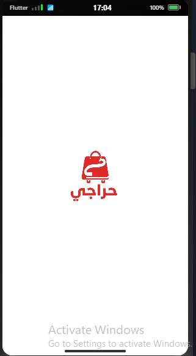
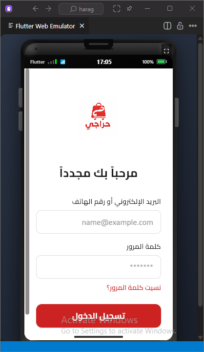
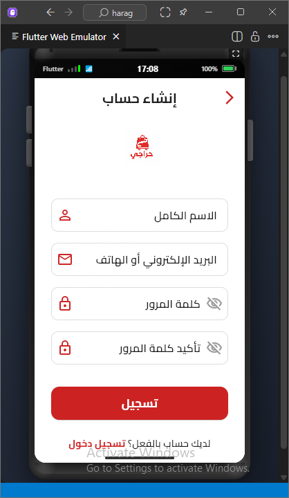
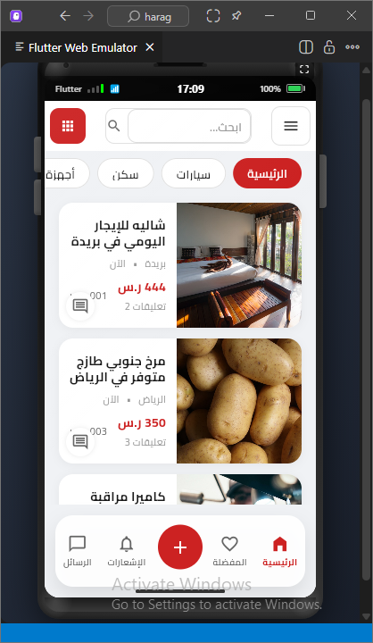
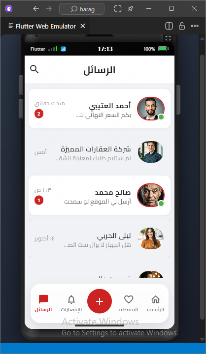
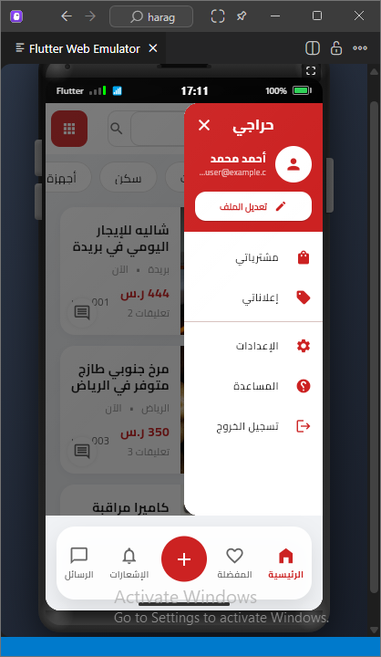

# Haraji App

A Flutter mobile marketplace application for buying and selling items.

## 📱 Overview

Haraji is a simple marketplace app that allows users to browse product listings, search for items, message sellers, and manage their profiles. The app features a clean interface with Arabic support.

## 🎨 App Screens

| Splash | Login | Sign Up |
|--------|-------|---------|
|  |  |  |

| Home | Messages | Drawer |
|------|----------|--------|
|  |  |  |

## ✨ Features

- User login and registration
- Browse product listings by category
- Search and filter products
- View product details with images
- Real-time messaging between users
- User profiles with ratings
- Favorites/Wishlist
- Settings and user preferences

## 🛠️ Tech Stack

- **Framework**: Flutter 3.0+
- **Language**: Dart
- **State Management**: Provider
- **UI**: Material Design
- **Fonts**: Google Fonts (Cairo for Arabic)


## 📦 Dependencies

```yaml
dependencies:
  flutter:
    sdk: flutter
  google_fonts: ^6.1.0
  cached_network_image: ^3.3.0
  provider: ^6.1.5+1
```

## 🚀 Getting Started

### Prerequisites
- Flutter SDK 3.0+
- Dart 3.0+

### Installation

```bash
# Clone the repository
git clone https://github.com/yourusername/haraji-app.git
cd haraji-app

# Install dependencies
flutter pub get

# Run the app
flutter run
```

### Build

```bash
# Android
flutter build apk --release

# iOS
flutter build ios --release
```

## 📄 License

MIT License - see LICENSE file for details
